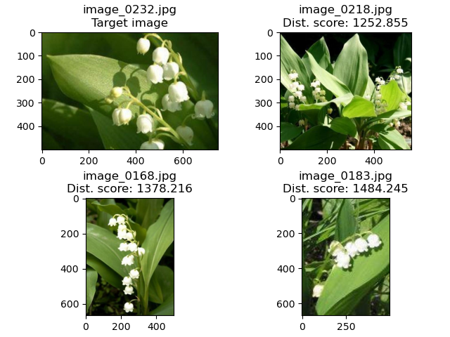

# Assignment 1 – Image search
The portfolio for __Visual Analytics S22__ consists of 4 projects (3 class assignments and 1 self-assigned project). This is the __first assignment__ in the portfolio.


## 1. Contribution
The initial assignment was made partly in collaboration with others from the course, but the final code is my own. I made several adjustments to the code since I first handed it in.

## 2. Assignment description
When we were first assigned the assignment, the assignment description was as follows:

For this assignment, you will write a small Python program to compare image histograms quantitively using Open-CV and the other image processing tools you've already encountered. Your script should do the following:

- Take a user-defined image from the folder
- Calculate the "distance" between the colour histogram of that image and all of the others.
- Find which 3 image are most "similar" to the target image.
- Save an image which shows the target image, the three most similar, and the calculated distance score.
- Save a CSV which has one column for the filename and three columns showing the filenames of the closest images in descending order.

## 3. Methods
The assignment was to identify the three most similar images to a given target image based on colour histogram comparisons. After some initial data wrangling (i.e. getting lists of all file names and paths in the directory, excluding non-image files, and specifying a target image), a normalised colour histogram is created for the target image and is then compared to colour histograms for all the other images in the directory. This is done by looping over the files in the directory that are not the target image, creating normalised colour histograms for each, comparing the histograms to that of the target image, and saving a list with the results. Then the three images with the lowest distance scores (i.e. with the most similar histograms compared to that of the target image) are identified and used to create the output CSV and PNG.

An argument parser was added to the code to make it possible for potential users to specify the target image themselves.

## 4. Usage
### Install packages
Before running the script, you have to install the relevant packages. To do this, run the following in the Terminal:
```
pip install --upgrade pip
pip install opencv-python
sudo apt-get update
sudo apt-get -y install graphviz
```

### Get the data
- Download the dataset from https://www.robots.ox.ac.uk/~vgg/data/flowers/17/index.html by clicking on *1. Dataset images* under *Downloads*.
- Place the `.tar`-file in the `in` folder.
- From the Terminal, change the current directory to the `in` folder by running `cd {PATH TO IN-FOLDER}` 
    - in `{PATH TO IN-FOLDER}` put in the path from where you are to the `in` folder, e.g. `cd CDS-VIS/VIS_assignment1/in`.
- Open the `.tar`-file by running ```tar -xvf 17flowers.tar```. This should "unzip" the `.tar`-file into a folder called `jpg`.

### Run the script
- Make sure you change the directory back to the `VIS_assignment1` folder.
- Then, from the `VIS_assignment1` directory, run:
```
python src/image_search_hist.py --image_index {INDEX}
```


`{INDEX}` represents a user-defined argument. Here, you can write any number from __0–1359__ and it will index your target image.

## 5. Discussion of results
When I ran the code, I chose `image_232` as my taget image and thus put in `231` as my target image index. The results can be seen in the `out` folder. The output files are:
- `hist_similar_images_indx231.csv`: A CSV with a row for the name of the target image and then three rows for the top three most similar images to the target image.
- `hist_similar_images_indx231.png`: An image of the target image and its three most similar images with their respective distance scores.



As you can tell if you look at the output, the method was relatively sucessful in this case. The flowers that were identified as the most similar to the target image do indeed seem to be of the same species as my target flower. I did find, however, that it did not work as well with all images, as it did for `image_0232`. If you put in `600`, for example, it seems as though all flowers on the pictures are of different species (a CSV and PNG for `image_0601` is provided in the output folder). It higlights the weakness of this type of method. As it only picks up on colour distributions, it fails to take into consideration other relevant factors like shape, size, number of flowers etc.


Thus, for this type of task a more advanced method would be beneficiary, e.g. using a pretrained model, like VGG16, to do feature extraction for all images and then using a nearest neighbour algorithm to find the images with less "distance" (like we did in Session 11).
