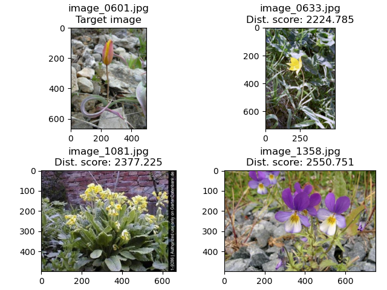

# Assignment 1 – Image search
The portfolio for __Visual Analytics S22__ consists of 4 projects (3 class assignments and 1 self-assigned project). This is the __first assignment__ in the portfolio.

Github repository: https://github.com/agnesbn/VIS_assignment1.

## 1. Contribution
The initial assignment was made partly in collaboration with others from the course, but the final code is my own. I made several adjustments to the code since I first handed it in.

## 2. Assignment description by Ross
### Main task
For this assignment, you will write a small Python program to compare image histograms quantitively using Open-CV and the other image processing tools you've already encountered. Your script should do the following:

- Take a user-defined image from the folder.
- Calculate the "distance" between the colour histogram of that image and all of the others.
- Find which 3 image are most "similar" to the target image.
- Save an image which shows the target image, the three most similar, and the calculated distance score.
- Save a CSV which has one column for the filename and three columns showing the filenames of the closest images in descending order.

### Bonus task
Create a program which does this for the whole dataset, creating a CSV with one column showing the file name for each image and three other columns showing the most similar images.

## 3. Methods
### Main task
The main script,[image_search_hist.py](https://github.com/agnesbn/VIS_assignment1/blob/main/src/image_search_hist.py), identifies the three most similar images to a user-defined target image based on colour histogram comparisons. After some initial data wrangling (i.e. getting lists of all file names and paths in the directory, excluding non-image files, and specifying a target image), a normalised colour histogram is created for the target image and is then compared to colour histograms for all the other images in the directory. This is done by looping over the files in the directory that are not the target image, creating normalised colour histograms for each, comparing the histograms to that of the target image, and saving a list with the results. Then the three images with the lowest distance scores (i.e. with the most similar histograms compared to that of the target image) are identified and used to create the output CSV and PNG.

### Bonus task
The script for the bonus task, [image_search_hist.py](https://github.com/agnesbn/VIS_assignment1/blob/main/src/image_search_hist.py), uses many of the same methods as the main script. It creates a list of histograms for all images, comapares them, finds the three most similar images to each image, and creates and saves plots for all and one big CSV with information about all images.


## 4. Usage
### Install packages
Before running the script, you have to install the relevant packages. To do this, run the following in the Terminal:
```
pip install --upgrade pip
pip install opencv-python
sudo apt-get update
sudo apt-get -y install graphviz
```

### Get the data
- Download the dataset from https://www.robots.ox.ac.uk/~vgg/data/flowers/17/index.html by clicking on *1. Dataset images* under *Downloads*.
- Place the `.tar`-file in the `in` folder.
- From the Terminal, change the current directory to the `in` folder and open the `.tar`-file by running:

```
tar -xvf 17flowers.tar
```


This should "unzip" the `.tar`-file into a folder called `jpg` so that the path to the input folder is `VIS_assignment1/in/jpg`.

### Main task: Image search with user-defined image
See code [here](https://github.com/agnesbn/VIS_assignment1/blob/main/src/image_search_hist.py).
- Make sure your current directory is the `VIS_assignment1` folder.
- Then, from the `VIS_assignment1` directory, run:
```
python src/image_search_hist.py --image_index <INDEX>
```

- `<INDEX>` represents a user-defined argument. Here, you can write any number from __0–1359__ and it will index your target image.
- The results are saved in [`out/user-defined`](https://github.com/agnesbn/VIS_assignment1/tree/main/out/user-defined).

### Bonus task: Image search with all images
See code [here](https://github.com/agnesbn/VIS_assignment1/blob/main/src/image_search_all.py).
- Make sure your current directory is the `VIS_assignment1` folder.
- Then, from the `VIS_assignment1` directory, run:
```
python src/image_search_all.py
```
- The results are saved in [`out/all`](https://github.com/agnesbn/VIS_assignment1/tree/main/out/all) (in this repo, only the first 10 plots and the CSV with all images are saved).

## 5. Discussion of results
When I ran the main code, I chose `image_232` as my taget image and thus put in `231` as my target image index. The output files are:
- [`hist_similar_images_indx231.csv`](https://github.com/agnesbn/VIS_assignment1/blob/main/out/user-defined/img0232_similar_images.csv): A CSV with a row for the name of the target image and then three rows for the top three most similar images to the target image.
- [`hist_similar_images_indx231.png`](https://github.com/agnesbn/VIS_assignment1/blob/main/out/user-defined/img0232_similar_images.png): An image of the target image and its three most similar images with their respective distance scores.

### Target image_232 and its three most similar images


As you can tell from the image, the method was relatively sucessful in the case of `image_232`. The flowers that were identified as the most similar to the target image do indeed seem to be of the same species as the target flower. I did find, however, that it did not work as well for all images, as it did for `image_0232`. For `image_601`, for example, it seems as though all flowers on the PNG are of different species.

### Target image_601 and its three most similar images


This higlights the weakness of this type of method. As it only picks up on colour distributions, it fails to take into consideration other relevant factors like the shape and size of the flowers. Thus, for this type of task a more advanced method would be beneficiary. We encountered one such method in Session 11, namely is using a pretrained model, like VGG16, to do feature extraction for all images and then using a nearest neighbour algorithm to find the images with less "distance".
